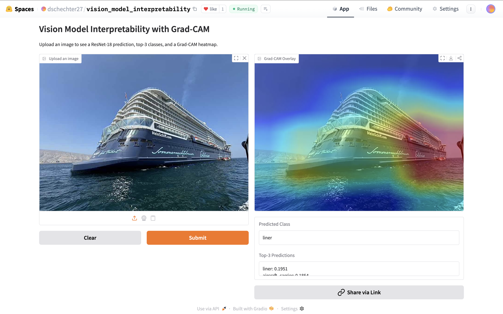
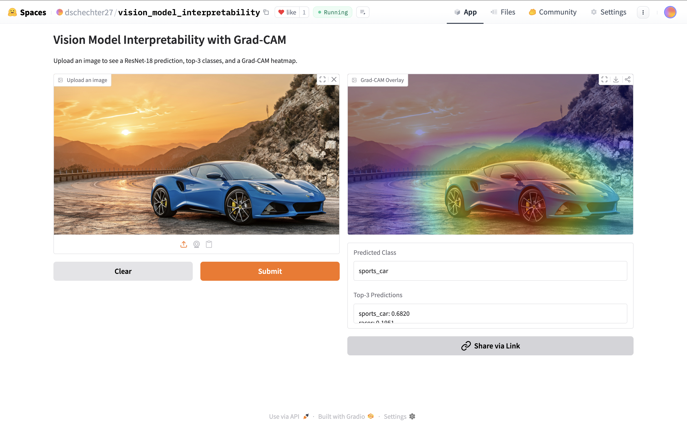
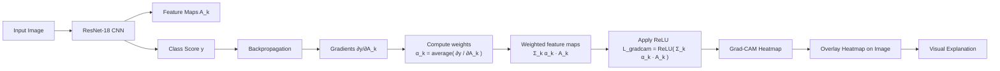

# Vision Model Interpretability with Grad-CAM

Interactive demo for **explaining CNN image classification** using **Grad-CAM (Gradient-weighted Class Activation Mapping)**.

This project allows users to:

- Upload an image
- Classify it using a **ResNet-18 convolutional neural network**
- View the **top-3 predicted ImageNet classes**
- Visualize a **Grad-CAM heatmap** highlighting which regions influenced the model’s prediction

The demo is deployed as an **interactive web application using Gradio** and hosted on **Hugging Face Spaces**.

---
## Purpose

Modern deep learning models often behave like black boxes, making it difficult to understand
why a particular prediction was made.

The goal of this project is to explore **model interpretability for convolutional neural networks**
by visualizing which image regions influence predictions.

Using Grad-CAM, we can trace how gradients flow through convolutional feature maps and produce
a heatmap highlighting the parts of the image most responsible for the model's decision.

This helps verify whether the model is focusing on meaningful visual features or spurious
background patterns.

---
# Live Demo

Try the interactive application here:

https://huggingface.co/spaces/dschechter27/vision_model_interpretability

Upload an image and instantly see the model’s prediction and visual explanation.

---

# Example Results

### Cruise Ship Example  
Model prediction: **liner**

Grad-CAM highlights the **structure of the ship**, showing that the model focuses on the correct object region.

---

### Dog Example  
Model prediction: **Bernese Mountain Dog**

The heatmap concentrates on the **dog’s body and head**, demonstrating that the model uses meaningful visual features when making its prediction.

---

### Sports Car Example  
Model prediction: **sports car**

Grad-CAM focuses on the **car body and wheels**, confirming that the model is identifying relevant vehicle features.

---
## Key Insights

Grad-CAM visualizations suggest that the CNN relies on localized semantic features when making
predictions.

Across several examples:

• For ships, the heatmap concentrates on the hull and upper deck structure  
• For dogs, the model focuses on the head and torso  
• For cars, the network highlights the body and wheel regions

These results indicate that the network is learning meaningful visual features rather than relying
primarily on background artifacts.

However, Grad-CAM can sometimes highlight broad regions rather than precise object boundaries,
which reflects the spatial resolution limitations of convolutional feature maps.

---

## How Grad-CAM Works

Grad-CAM explains CNN predictions by analyzing the **gradient of the predicted class score with respect to convolutional feature maps**.

---
## Model Pipeline

---
# Project Pipeline

Image  
→ ResNet-18 Prediction  
→ Gradient Backpropagation  
→ Grad-CAM Heatmap  
→ Visual Explanation

---

# Repository Structure

vision-model-interpretability/

assets/                 # README example screenshots  
images/                 # original input images  
results/                # Grad-CAM outputs  

app.py                  # Gradio web application  
requirements.txt        # project dependencies  
vision_model_interpretability.ipynb   # development notebook  
README.md  

---

# Technologies Used

- **PyTorch**
- **Torchvision**
- **Grad-CAM**
- **Gradio**
- **OpenCV**
- **NumPy**
- **Hugging Face Spaces**

---

# Running Locally

Install dependencies:
 - pip install -r requirements.txt

Run the web app:
 - python app.py

Then open the Gradio interface in your browser to upload images and visualize model explanations.

---

# Author

**David Schechter**  
MIT Class of 2030  

Interested in **machine learning, AI interpretability, and computer vision**.

GitHub: https://github.com/dschechter27875

---

# License

MIT License
